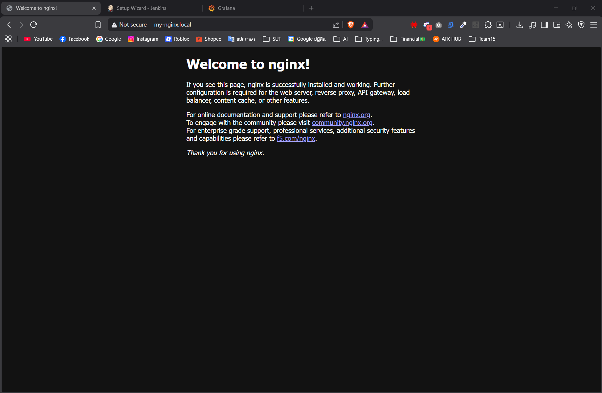
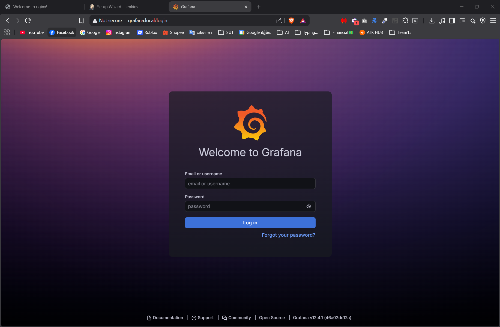

**B6606138 นายธนพล สงกล้า**

Assignment นี้เป็นการทดสอบตั้งค่า NGINX Ingress Controller บน Kubernetes เพื่อควบคุมช่องทางการเข้าถึง Service ต่างๆ ผ่านชื่อโดเมนท้องถิ่น (Local Domain) ภายในเครื่อง ประกอบไปด้วยบริการ:
- **NGINX Web Server** (`my-nginx.local`)
- **Jenkins CI/CD** (`jenkins.local`)
- **Grafana Dashboard** (`grafana.local`)

## การแก้ไข `hosts` File
ในการทำให้เครื่องสามารถรู้จักโดเมน `.local` จำเป็นต้องจับคู่ IP ท้องถิ่นของเครื่อง เข้ากับชื่อเพื่อให้ Ingress สามารถอ่านค่าและเปิดใช้งานได้ โดยแก้ไขที่ `C:\Windows\System32\drivers\etc\hosts`:
```text
127.0.0.1 my-nginx.local
127.0.0.1 jenkins.local
127.0.0.1 grafana.local
```

## ผลการทำงาน (Screenshots)

หลังจากทำ Port Forward หรือเชื่อมต่อ Ingress เสร็จเรียบร้อยแล้ว เมื่อเข้าผ่านเว็บบราว์เซอร์จะได้ผลลัพธ์ดังนี้ครับ:

### 1. NGINX
เข้าถึงได้ที่ URL: `http://my-nginx.local`


---

### 2. Jenkins
เข้าถึงได้ที่ URL: `http://jenkins.local`

---

### 3. Grafana
เข้าถึงได้ที่ URL: `http://grafana.local`

